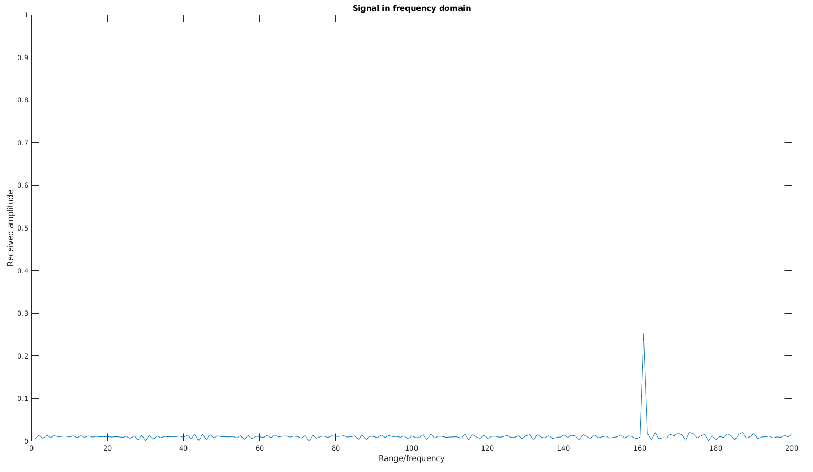
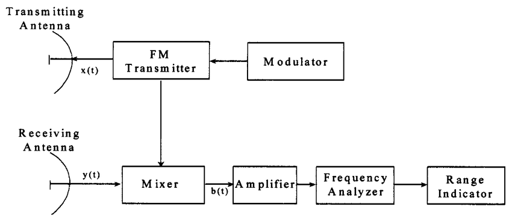
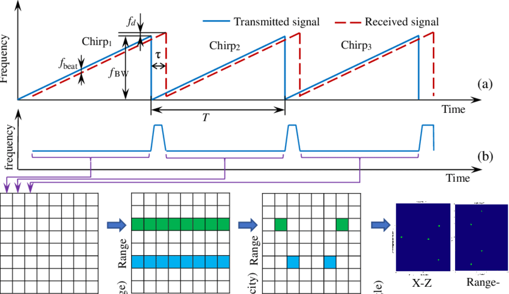
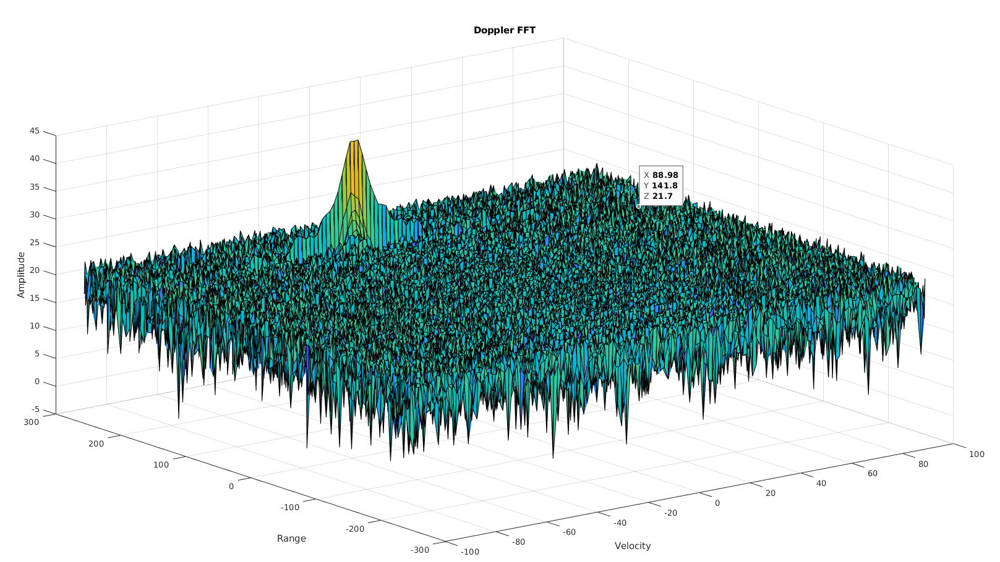
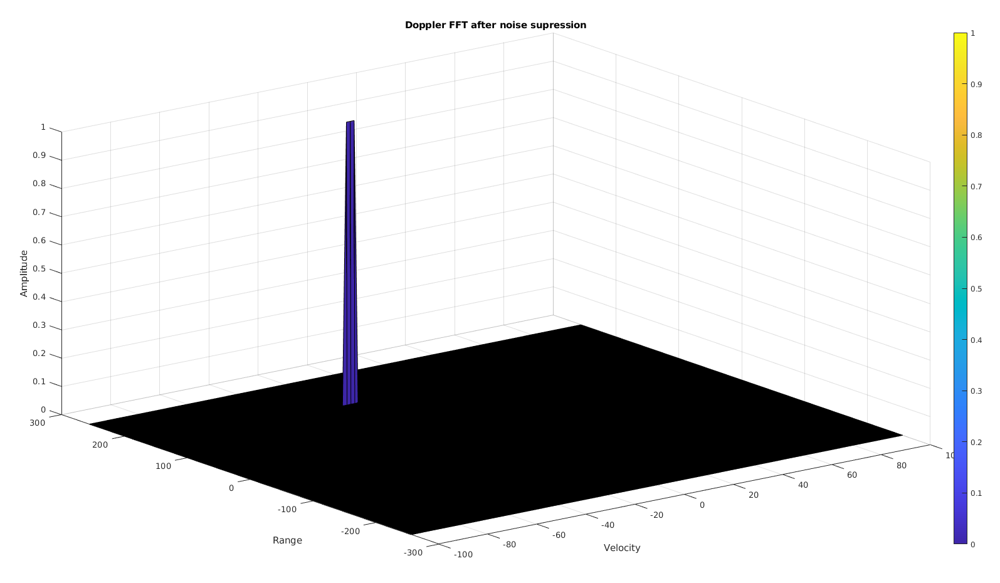

[](https://www.udacity.com/course/sensor-fusion-engineer-nanodegree--nd313)

# Udacity Nanodegree: Sensor Fusion

## Project 04: Radar target generation and detection

<p align="center">
    
</p>

This project aims to develop a software stack that will enable us to achieve the following objectives.

```
* Good understanding of the working principle of FMCW(Frequency Modulated Continuous Wave) Radar
* Range detection 
* Velocity detection
* Detection of Angle of Approach
* Constant false alarm rate (CFAR) noise suppression
* Signal-to-noise ratio (SNR) and dynamic thresholding
```
The complete Project pipeline is as follows. 


To achieve our goal we need to complete the following six major tasks: 

1. Configuring the FMCW radar which meets the required specifications
2. The second task is to create a virtual environment to simulate moving vehicle
3. Then we have to collect the response from Radar and perform Range FFT
4. Once we get range reading for all the chirps, we need to perform the Doppler FFT to determine the velocity
5. The next task is to determine the angle of approach for which we will use MATLAB toolbox
6. Finally, to get a better estimate of velocity and distance without false positives, we need to suppress the noise.

### Dependencies for Running Locally
* Matlab
    - Automated Driving Toolbox
    - Signal Processing Toolbox
    - DSP System Toolbox

### Basic execution Instructions

#### 1. First of all, clone this repo:
```
$ git clone git@github.com:Suraj0712/SFND_4_Radar_Target_Generation_and_Detection.git
```

#### 2. Run Quiz
```
$ cd <Path_to_quiz_directory>
$ matlab <name_of_quiz_file>.m
$ click on <Run>
```
#### 3. Run Project
```
$ cd <Path_to_Project_directory>
$ matlab Radar_Target_Generation_and_Detection.m
$ click on <Run>
```

### Project Rubric

#### Task.1 FMCW Waveform Design

Using the given system requirements, design a FMCW waveform. Find its Bandwidth (B), chirp time (Tchirp) and slope of the chirp.
 
* FMCW Radar characteristics


   > We already have the Radar requirement specifications which are as follows
```
Frequency of operation = 77GHz
Max Range              = 200m
Range Resolution       = 1 m
Max Velocity           = 100 m/s
Speed of light         = 3*10^8 m/s
Sweep time factor      = 5.5;
```
   > We know that the Bandwidth of the chirp is only depends on the Range resolution. And its mainly because the signal in frqeuancy domain can only de distictly identified if we have enough frqeuancy difference and time of observation. simillarly the chirp time is only dependent on the Sweep time factor. we need to have sweep time factor more than two inorder to avoid the interference of signals. to get the slope of chirp we just need to get the ration of prior quantities.

* Bandwidth   = speed of light / (2 * Range Resolution)        = 150 *10^6 Hz
* chirp time  = (sweep time factor*2*Max Range)/speed of light = 7.33 *10^-6 sec
* slope       = Bandwidth / chirp time                         = 2.0455 * 10^13

#### Task.2 Simulation Loop
Simulate Target movement and calculate the beat or mixed signal for every timestamp.

   > I first created a discrete vector of time which has bins corresponding to sampling ```frequency of chirp * #chirps in one sweep```. As we already knew the distance of object and its velocity we can simulate the transmitted and received signal and store the same in the vector of same size as time vector by updating the range by looping.


#### Task.3 Range FFT (1st FFT)
Implement the Range FFT on the Beat or Mixed Signal and plot the result.


   > The FMCW radar uses the linear increase in frequency to detect the distance. To make it bit more simple we know that the received signal is nothing but replica of transmitted signal with some delay. As you can see the following block diagram the mixer have access to both transmitted and received signal and to get the beat frequency it substract the received signal. Every object will have its corresponding bit frquency based on its range. to get the beat frequency associated with the signal we need to convert the signal from time domain to frequancy domain and in frequency domain every peak will corrsponds to object.




#### Task.4 Doppler FFT (2nd FFT)
Implement the Doppler FFT based on the Range FFT readings.

   > We know that if the source and the observer have the relative velocity the frequncy observed will have some shift and generally it is used for determining the velocity. However in case of the FMCW Radar the we care about beat frequancy and which is predominatly dominated by the range of object. To get he velocity estimation from the FMCW radar we focus on the phase of the received signal. we know that in FMCW we send multiple chirps in one sweep. for every chirp the range fft will look identical and if we calculate the change of phase difference over each chirp we can get the velocity. You can follow the following image for more details.



#### Task.5 2D CFAR
Implement the 2D CFAR process on the output of 2D FFT operation, i.e the Range Doppler Map.

   > To supress the Noise and to avoid the false positives we implemented the ```cell averaging constant false alarm rate``` technnic. In this technic we have a 2d mask which contains the guard cell(which avoids the signal supression) and training cells. we slide this mask over entire image and replace the value at a particular cell by avarage of training cells. this technics works cause we assume noise is spatially and temporally same. the offset is very important parameters to avois the false positives, HOwever large offset factor might lead to supression of valid signal. 


### References

[FMCW leature series](https://www.youtube.com/playlist?list=PLJAlx-5DOdeMNjpg4sRO6cty3gL_PZeCE)

## Thank you
